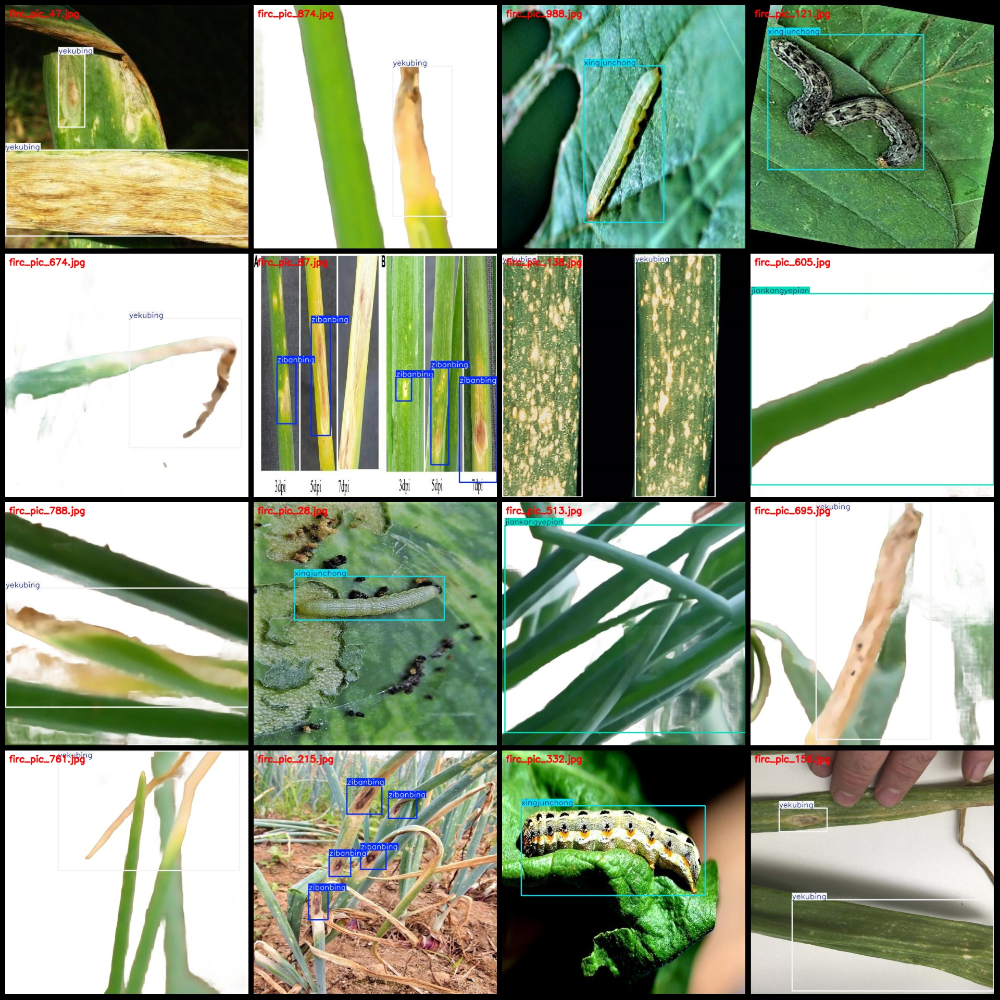

# Onion Diseases Detection Dataset VOC+YOLO with 1053 Images and 4 Categories

Dataset format: Pascal VOC format + YOLO format (txt files without split paths, only containing jpg images and corresponding VOC format xml files and YOLO format txt files)
Number of images (jpg file counts): 1053
Number of annotations (xml file counts): 1053
Number of annotations (txt file counts): 1053
Number of categories: 4
Categories in the annotation file (not matching this order according to yolo format, but following the order in the labels folder classes.txt): ["jiankangyepian", "xingjunchong", "yekubing", "zibanbing"]
["healthy leaves", "insects", "leaf diseases", "purple spot disease"]
Box count for each category:
jiankangyepian = 262
xingjunchong = 239
yekubing = 530
zibanbing = 381
Total boxes: 1412
Number of pictures per category:
jiankangyepian = 260
xingjunchong's total number of images = 188
Yekubing's number of photos = 405
Zibanbing has 201 images.
Image resolution: 640x640
Use the labeling tool: LabelImg.
Annotation rule: Draw a rectangle around the class for the given class.
Important notes: The dataset does not have separate training, validation, and test sets, so you need to manually divide them.
Special statement: This dataset does not guarantee any accuracy in the trained model or weight file.
Image preview:
Example:
## Image

Here is a pay link on Stripe ( https://buy.stripe.com/3cs8yP7sY87d0vu9AB ). Please contact me lonlonago@foxmail.com after funding $89, and I will send you a complete data files , thank you!

